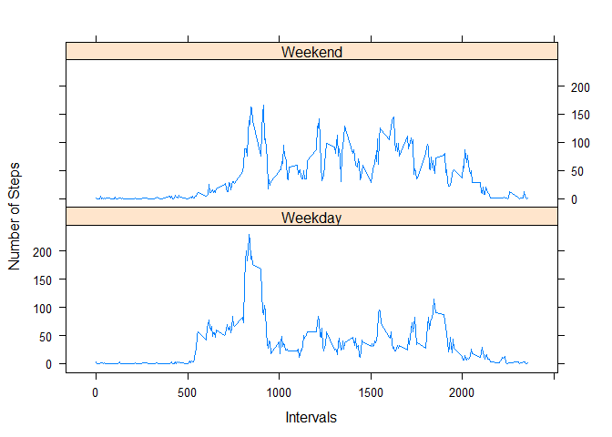

# Reproducible Research: Peer Assessment 1

## Loading and preprocessing the data

The first step to any research is to load the necessary packages and the data 
itself.


```r
    library(ggplot2)
    activity <- read.csv("activity.csv")
```

## What is mean total number of steps taken per day?

Next we'll determine our total steps for each day.


```r
    total <- tapply(activity$steps, activity$date, sum, na.rm=TRUE)
    total
```

```
## 2012-10-01 2012-10-02 2012-10-03 2012-10-04 2012-10-05 2012-10-06 
##          0        126      11352      12116      13294      15420 
## 2012-10-07 2012-10-08 2012-10-09 2012-10-10 2012-10-11 2012-10-12 
##      11015          0      12811       9900      10304      17382 
## 2012-10-13 2012-10-14 2012-10-15 2012-10-16 2012-10-17 2012-10-18 
##      12426      15098      10139      15084      13452      10056 
## 2012-10-19 2012-10-20 2012-10-21 2012-10-22 2012-10-23 2012-10-24 
##      11829      10395       8821      13460       8918       8355 
## 2012-10-25 2012-10-26 2012-10-27 2012-10-28 2012-10-29 2012-10-30 
##       2492       6778      10119      11458       5018       9819 
## 2012-10-31 2012-11-01 2012-11-02 2012-11-03 2012-11-04 2012-11-05 
##      15414          0      10600      10571          0      10439 
## 2012-11-06 2012-11-07 2012-11-08 2012-11-09 2012-11-10 2012-11-11 
##       8334      12883       3219          0          0      12608 
## 2012-11-12 2012-11-13 2012-11-14 2012-11-15 2012-11-16 2012-11-17 
##      10765       7336          0         41       5441      14339 
## 2012-11-18 2012-11-19 2012-11-20 2012-11-21 2012-11-22 2012-11-23 
##      15110       8841       4472      12787      20427      21194 
## 2012-11-24 2012-11-25 2012-11-26 2012-11-27 2012-11-28 2012-11-29 
##      14478      11834      11162      13646      10183       7047 
## 2012-11-30 
##          0
```

Not bad information, but a histogram would be easier to read.


```r
    hist(total)
```

 

We might like to see the mean and the median as well.


```r
    mean(total, na.rm=TRUE)
```

```
## [1] 9354.23
```

```r
    median(total, na.rm=TRUE)
```

```
## [1] 10395
```

## What is the average daily activity pattern?

Now lets look at the intervals.  Specifically, the average number of steps taken
per interval across all the days. We also want to put this into a data frame 
that we can then use for our plot.


```r
steps <- tapply(activity$steps, as.factor(activity$interval), mean, na.rm = TRUE)
steps <- as.vector(steps)
intervals <- as.vector(unique(activity$interval))
byint <- data.frame(steps, intervals)
```

Now we can create our time series plot!


```r
plot(byint$intervals, byint$steps, type = "l")
```

 

Clearly, more steps are taken in the morning, around lunchtime, and in the 
evening. This makes sense with work schedules. But during what interval are the 
most steps taken? Let's find out!


```r
byint$intervals[which.max(byint$steps)]
```

```
## [1] 835
```

So, at 0835 the most steps, on average, were taken each day!

## Imputing missing values

Looking at the original data, there are a lot of NAs. How many, you ask?


```r
sum(is.na(activity$steps))
```

```
## [1] 2304
```

2304 NAs! That's a lot. Let's fill in all the NAs. We'll use our average steps
for all days of the given time interval to fill them in.


```r
activity.noNAs <- activity
for(i in 1:nrow(activity.noNAs)){
if(is.na(activity.noNAs$steps[i])){
    activity.noNAs$steps[i] = byint$steps[which(byint$intervals == 
                                                    activity.noNAs$interval[i])]
}}
```

Excellent, now that all our NAs are filled in, we're ready to graph a new 
histogram!


```r
total.noNAs <- tapply(activity.noNAs$steps, activity.noNAs$date, sum)
hist(total.noNAs)   
```

 

Interesting...
Let's take a look at the mean and median.


```r
mean(total.noNAs)
```

```
## [1] 10766.19
```

```r
median(total.noNAs)
```

```
## [1] 10766.19
```

Well now, that's interesting! Our histogram has a distribution that more closely
resembles a bell curve! Also, by imputing the NAs we have increased both our 
mean and median. As a matter of fact, the median and the mean are now the same
number! 

What does that tell us? I'd say that the majority of the NAs were from times 
when one could expect to have walked more!

## Are there differences in activity patterns between weekdays and weekends?

Our final task is to look at weekdays versus weekends.

Let's add a factor to denote which days are weekends and which are weekdays.


```r
for(i in 1:nrow(activity.noNAs)){
    activity.noNAs$daytype[i] <- 
        ifelse(weekdays(as.Date(activity.noNAs$date[i])) 
               %in% c("Saturday","Sunday"), "Weekend","Weekday")
}
```

Now we want to look at plots of average steps per day with respect to weekends
and weekdays.

First we'll split up our weekend averages and our weekday averages and put them
into a data frame with our intervals


```r
byday <- tapply(activity.noNAs$steps, list(activity.noNAs$interval, 
            activity.noNAs$daytype), mean)
byday <- as.data.frame(byday)
byday$interval <- unique(activity.noNAs$interval)
final <- append(byday$Weekend, byday$Weekday)
final <- as.data.frame(final)
final$intervals <- append(byday$interval, byday$interval)
colnames(final) <- c("Steps","Intervals")
for(i in 1:nrow(final)){
    final$DayType[i] <- ifelse(i <= 288, "Weekend", "Weekday")
}
```

Now we can easily graph our results.


```r
library(lattice)
xyplot(Steps ~ Intervals | as.factor(DayType), data = final, type = "l", 
       layout = c(1,2), ylab = "Number of Steps")
```

 

As we can see, more steps are taken during Weekday mornings, whereas on Weekends
the number of steps taken throughout the day is more varied.
